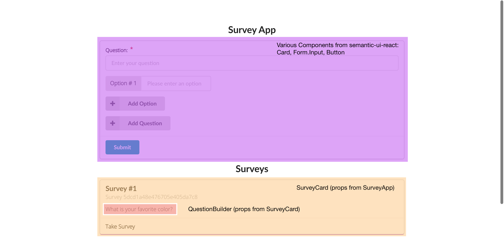
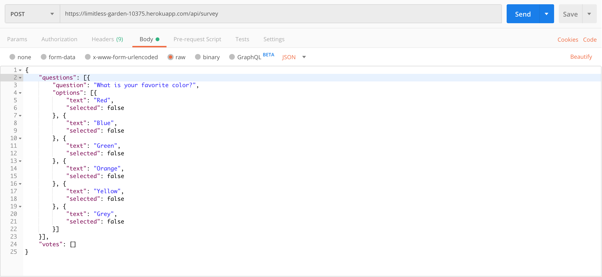
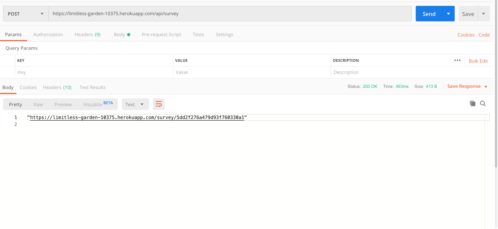
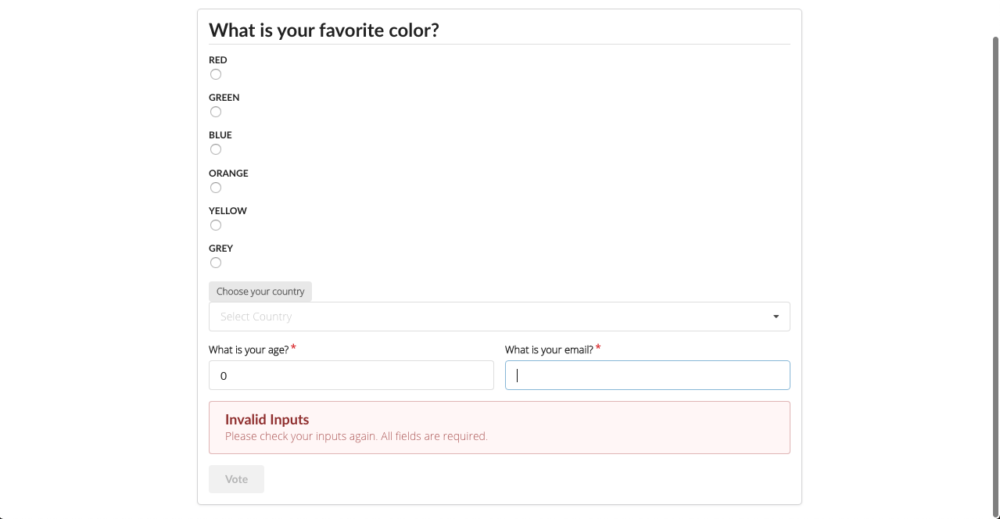
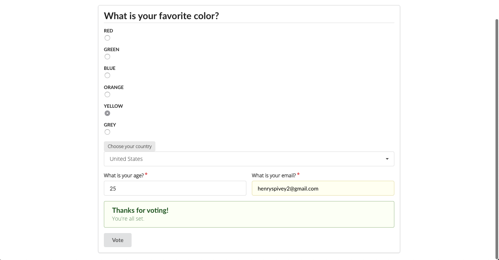

This is my submission for the TomTom Programming assignment.  Here you will find information about the technologies/tools used as well as the rationale for using them.  

This project was bootstrapped with [Create React App](https://github.com/facebook/create-react-app).

## Technologies Used

In the project directory, you can run:

### Frontend: React + Semantic UI library
### Backend:  Go
### DB:  Mongo

To run the app in the development mode, you'll need Go installed on your machine as well as npm.<br>
From the `client` directory, run `npm run start`.  From the `server` directory, run `go run main.go`<br>
Open [http://localhost:3000](http://localhost:3000) to view it in the browser.

The page will reload if you make edits.<br>
You will also see any lint errors in the console.

### Why React?

React is a great way to build web applications in JavaScript.  I chose React because it is a library that I'm very familiar with.  In addition, it makes reusability of components really easy. To see the components, please see the `client/src` directory and the screenshot below. In addition, the [Semantic UI library](https://react.semantic-ui.com/) offers a great variety of components to use in your application.


### Why Go?
Before this project, I had never used Go to build a web application before.  I welcomed the challenge of learning a new language and the nuances therein.  I also wanted to use it to show that I'm not tied to one particular language.  In the process I found that Go comes with all of the tools necessary to build an application: modify HTTP headers, routing, structs to model your data, JSON encoding and much more.  


### Why Mongo?
It turns out that the Mongo has incredibly well written documentation for Go users.  I referenced this a lot during development. See link here: [Mongo GO Documentation](https://docs.mongodb.com/manual/crud/) 

### Tools used
1. [Go Heroku build pack](https://github.com/heroku/heroku-buildpack-go)
2. [Heroku](https://dashboard.heroku.com/login)
3. [Glide for dependency management](https://github.com/Masterminds/glide)
4. [Postman for API testing](https://www.getpostman.com/)

### How to use the API
1. Send a POST request to `https://limitless-garden-10375.herokuapp.com/api/survey` with a body following a  structure like this:
```json
{
	"questions": [{
		"question": "What is your favorite color?",
		"options": [{
			"text": "Red",
			"selected": false
		}, {
			"text": "Blue",
			"selected": false
		}, {
			"text": "Green",
			"selected": false
		}, {
			"text": "Orange",
			"selected": false
		}, {
			"text": "Yellow",
			"selected": false
		}, {
			"text": "Grey",
			"selected": false
		}]
	}],
	"votes": []
}
```


In the status window you will see the link to the newly created survey which should look something like this:



### Improvements
Here's some of the things that I want to improve:
1. Add a results page to show the responses.  
2. Add JWT to force users to send an AUTH header to protect the API endpoints.
3. Use React Hooks
4. Use .ENV or configuration file to hold variables such as Mongo DB URL and authentication info. 


### Other
Survey with validation errors



Survey with vote success


